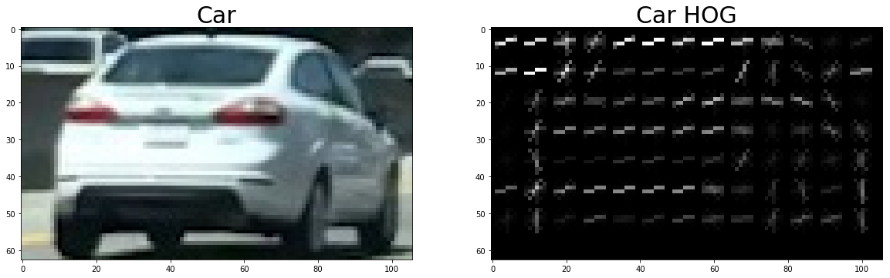
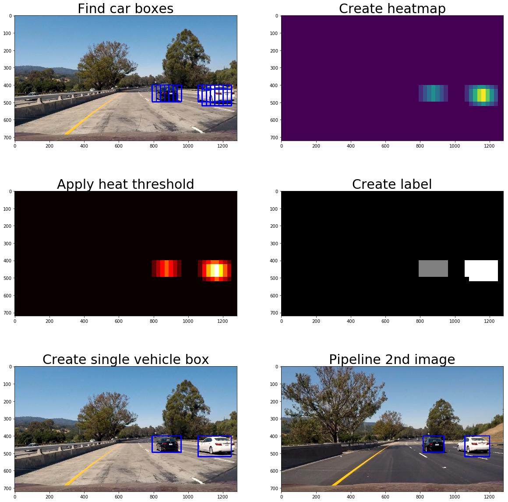

# Vehicle Detection
## Project 5

---

**Vehicle Detection Project**

The goals / steps of this project are the following:

* Perform a Histogram of Oriented Gradients (HOG) feature extraction on a labeled training set of images and train a classifier Linear SVM classifier
* Optionally, you can also apply a color transform and append binned color features, as well as histograms of color, to your HOG feature vector.
* Note: for those first two steps don't forget to normalize your features and randomize a selection for training and testing.
* Implement a sliding-window technique and use your trained classifier to search for vehicles in images.
* Run your pipeline on a video stream (start with the test_video.mp4 and later implement on full project_video.mp4) and create a heat map of recurring detections frame by frame to reject outliers and follow detected vehicles.
* Estimate a bounding box for vehicles detected.

## [Rubric](https://review.udacity.com/#!/rubrics/513/view) Points
### Here I will consider the rubric points individually and describe how I addressed each point in my implementation.  

---
### Writeup / README

#### 1. Provide a Writeup / README that includes all the rubric points and how you addressed each one.  You can submit your writeup as markdown or pdf.  [Here](https://github.com/udacity/CarND-Vehicle-Detection/blob/master/writeup_template.md) is a template writeup for this project you can use as a guide and a starting point.  

You're reading it!

### Histogram of Oriented Gradients (HOG)

#### 1. Explain how (and identify where in your code) you extracted HOG features from the training images.

In `Step 1 - Process images for training data` of my `project5.ipynb` notebook, I used the given GTI and KITTI vehicle and non-vehicle images. In the function `extract_features`, I did a combination of spatial binning (`bin_spatial`), color histogram (`color_hist`), and histogram of oriented gradient (HOG, `get_hog_features`) for feature extraction. I found using all three feature vectors was more accurate than just the HOG features alone (although not by much).

#### 2. Explain how you settled on your final choice of HOG parameters.

Through experimentation, I found the parameters listed below to give me the best feature data that when compared against a test set. These parameters lead to classifier accuracy of greater than 99%.

```python
cspace = 'YCrCb'
orient = 9
pix_per_cell = 8
cell_per_block = 2
hog_channel = 'ALL'
```

Below in the image you can see a pretty well defined car from the the HOG extraction:



#### 3. Describe how (and identify where in your code) you trained a classifier using your selected HOG features (and color features if you used them).

In `Step 2 - Train a classifier` of my `project5.ipynb` notebook, in the `train` function, I implement a Linear Support Vector Classifier (Linear SVC). But first, I normalize the training data (the combined extracted feature from above) and remove 20% for a test set. This was made easy by the scikit-learn functions: StandardScaler, train_test_split, & LinearSVC.

### Sliding Window Search

#### 1. Describe how (and identify where in your code) you implemented a sliding window search.  How did you decide what scales to search and how much to overlap windows?

In `Step 3 - Create pipeline` of my `project5.ipynb` notebook, in the `find_cars` function, I implement a sliding window technique to find the cars in the image window. The sliding window only looks for cars in the region of the image where cars would be found, eliminating the sky at the top and the hood of the car at bottom. Likewise, the images are scaled down as all the high-resolution image pixels aren't needed (and take longer) to identify vehicle. I used a scale of 1.5 and slide of 2 cells per step as these values were used in the lecture videos and produced good results for me.


#### 2. Show some examples of test images to demonstrate how your pipeline is working.  What did you do to optimize the performance of your classifier?

In the images below, you can see the steps my pipeline took. Using the slide window search, it found rectangles it believed were vehicles. Then from the rectangles created a heatmap that was then applied against a heatmap threshold value, 1. From there, the heatmap used the `label` function from scipy to create a single colored shape. Lastly, that shape was converted to a rectangle and redrawn back on the original image.


---

### Video Implementation

#### 1. Provide a link to your final video output.  Your pipeline should perform reasonably well on the entire project video (somewhat wobbly or unstable bounding boxes are ok as long as you are identifying the vehicles most of the time with minimal false positives.)

My final output video is in `output_images/project_video_output.mp4` ([link](output_images/project_video_output.mp4)). There you will also find the test output video.

#### 2. Describe how (and identify where in your code) you implemented some kind of filter for false positives and some method for combining overlapping bounding boxes.

In `Step 3 - Create pipeline` of my `project5.ipynb` notebook, in the `pipeline` function, I implement a heatmap averaging solution to filter out false positives. I found this step to be *critical* to preventing false positives and stable vehicle boxes that don't jump around every frame.

---

### Discussion

#### 1. Briefly discuss any problems / issues you faced in your implementation of this project.  Where will your pipeline likely fail?  What could you do to make it more robust?

This was a very interesting project! A few thoughts:

1 - Hog features were the most important feature extraction. Though spatial binary and color histogram did help some, it was interesting to think about future project where combining features extractions could be a great benefit.
2 - The training dataset is mostly of rear-ends of cars, so the classier doesn't do as well with side images of vehicles in the videos.
3 - Likewise, two vehicles side-by-side produce one vehicle box. It would probably be better for them to be identified as separate entities. This might could be down with heatbox labels of different colors.
